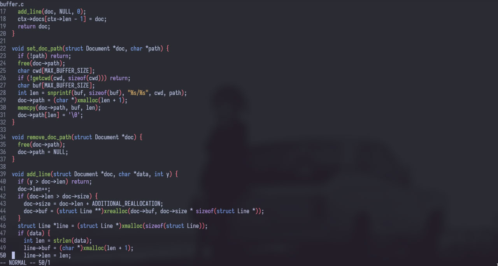

<div align="center">
  <h3>le</h3>
  <p>Light terminal vim-like text editor </p>
  <div>
    
    
    
  </div>
</div>

# Preview


# Building
```
git clone https://github.com/f01zy/Editor && cd Editor
mkdir build && cd build
cmake ..
make
```
